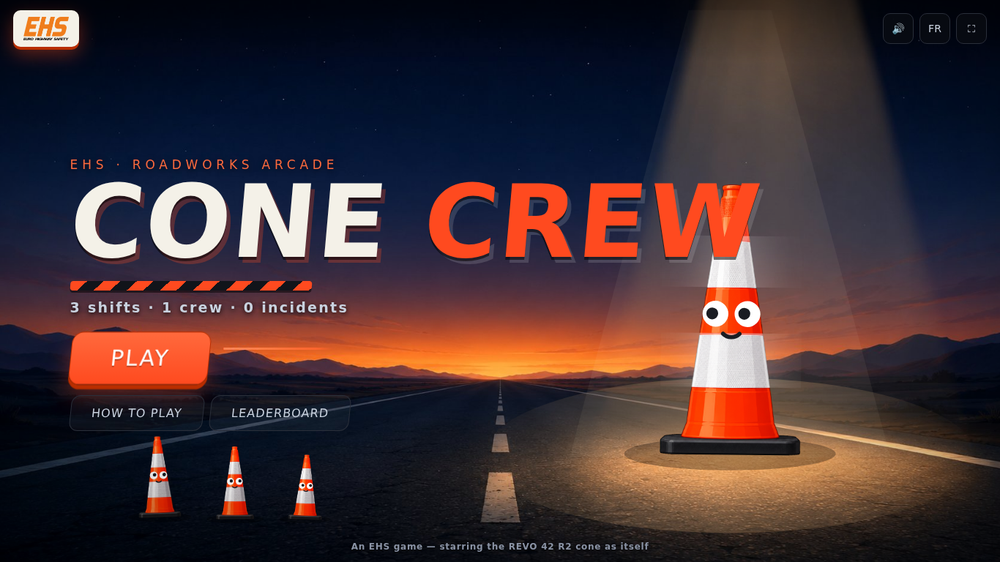
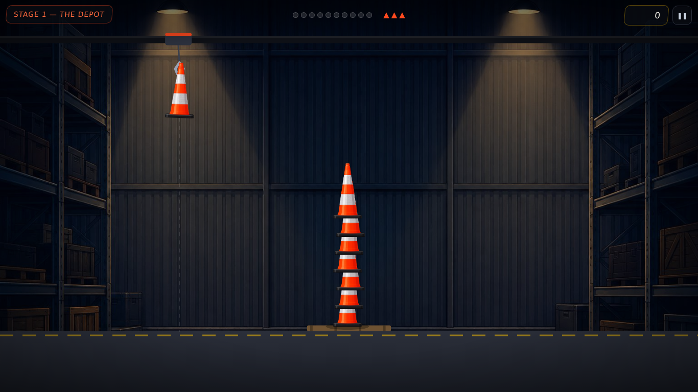
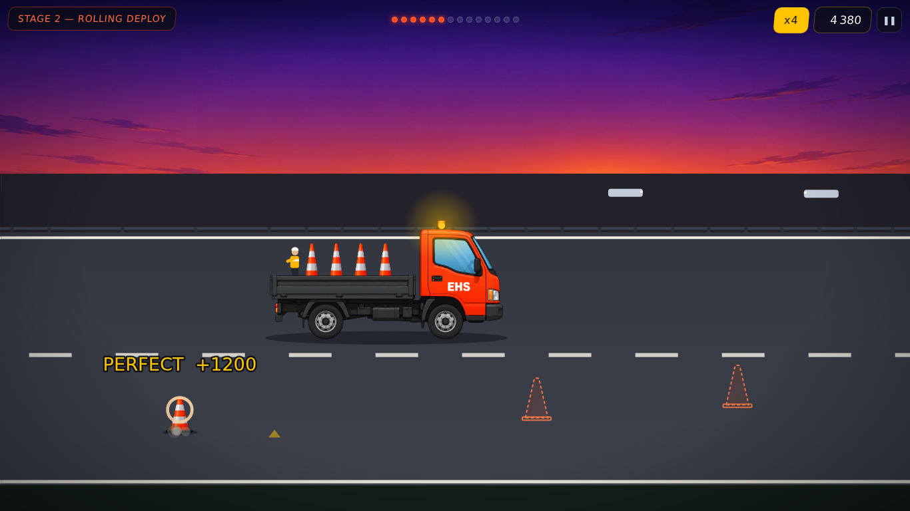
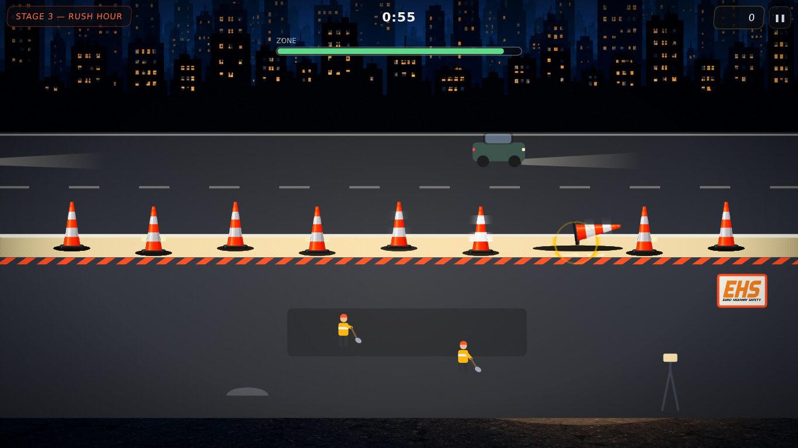
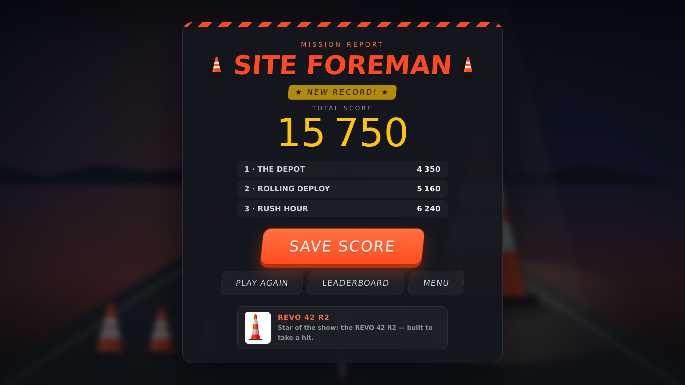

# 🦺 CONE CREW — the EHS roadworks arcade

**Three shifts. One crew. Zero incidents.**

A fast, juicy, three-stage arcade game built for EHS trade-show booths — starring the
**REVO 42 R2** traffic cone as itself. Runs in any modern browser, works offline,
plays with mouse, keyboard or touch, and keeps a local leaderboard so booth visitors
battle for the top spot.

🇫🇷 Interface bilingue : le jeu détecte la langue du navigateur (FR/EN) et se bascule
d'un bouton depuis le menu.



## The three stages

| # | Stage | What you do |
|---|-------|-------------|
| 1 | **LE DÉPÔT / THE DEPOT** | A claw swings over the pallet — tap to drop and stack 10 cones dead centre. Perfect drops chain combos; 3 misses and the depot closes. |
| 2 | **POSE EXPRESS / ROLLING DEPLOY** | Ride the EHS works truck down a dusk highway and drop a cone on every marker to close the lane with a perfect taper. The truck only speeds up. |
| 3 | **HEURE DE POINTE / RUSH HOUR** | Night shift. Wind gusts and grazing traffic knock your cone line flat — tap cones back upright and hold the work zone for 60 seconds. Watch the reflective bands light up in the headlights. |

Scores carry across stages into a **mission report** with a rank
(Rookie → Road Crew → Site Foreman → Cone Legend), arcade-style initials entry,
and a persistent top-10 leaderboard.

| Stage 1 — The Depot | Stage 2 — Rolling Deploy |
|---|---|
|  |  |

| Stage 3 — Rush Hour | Mission report |
|---|---|
|  |  |

## Run it

No build, no dependencies — it's plain HTML/CSS/JS on a canvas.

```bash
# option 1: just open it
open index.html            # double-clicking the file works too

# option 2: serve it (enables the offline service worker)
npx serve .
```

### Deploy to GitHub Pages

Repo **Settings → Pages → Deploy from a branch**, pick your branch and `/ (root)`.
The game is a static site; nothing else to configure. First visit caches everything,
so it keeps working when the venue wifi dies.

## Booth / kiosk notes

- **Fullscreen** button (⛶) lives in the menu top-right; the game is happiest fullscreen on a touch screen.
- **Touch-first**: every interaction is a single tap; stage 3 supports multi-touch.
- **Idle watchdog**: an abandoned session returns to the menu by itself (75 s in-game, 2 min on result screens).
- **Offline**: served over HTTP(S) once, the service worker caches the whole game (works from a USB stick via `file://` too — only the Google display font falls back).
- **Reset the leaderboard** between shows: open the browser console and run `localStorage.clear()`.
- Sound is synthesised (WebAudio) — no audio files, and a 🔊 toggle in the menu.

## Project map

```
index.html        shell + script order
css/style.css     EHS branding, HUD, menus (safety orange #FF4A1F)
js/util.js        math, easing, storage
js/i18n.js        all FR/EN strings
js/audio.js       synthesised SFX
js/sprites.js     AI-art sprite/backdrop loader (assets/img/) with vector fallback
js/cone.js        the REVO 42 R2 (one function draws every cone; sprite or vector)
js/fx.js          particles, confetti, floaters, screen shake
js/scenes.js      scene manager
js/ui.js          HUD + overlay screens (menu, results, leaderboard…)
js/menu.js        animated attract backdrop
js/stage1.js      The Depot (stacker)        — tuning constants at the top
js/stage2.js      Rolling Deploy (lane taper)
js/stage3.js      Rush Hour (hold the line)
js/main.js        boot, loop, input, game flow, ranks & leaderboard
test/smoke.js     headless end-to-end test: node test/smoke.js
```

### Artwork pipeline

The cone, the truck and the four backdrops are AI-generated (GPT Image 2, with a
real photo of the REVO 42 R2 as reference — prompts in `docs/prompts-images-ia.md`).
Raw green-screen originals live in `assets/sprites/`; run
`python3 tools/process-sprites.py` to chroma-key/compress them into the
`assets/img/` files the game loads. The official EHS logo
(`assets/sprites/logo.png`, shown in the menu badge and on the stage-3 site
sign) goes through the same script — trim + downscale only. If any image is missing, `js/sprites.js`
reports it as not ready and the game falls back to the original vector drawing.

Difficulty, scoring and rank thresholds are plain constants at the top of each stage
file and in `js/main.js` (`RANKS`).

## Test

```bash
node test/smoke.js
```

Simulates a complete session (all three stages, scoring, initials, leaderboard,
pause/quit, resizes) against stubbed DOM/canvas — no browser needed.

---

*An EHS promo game. The REVO 42 R2 performed all of its own stunts.*
